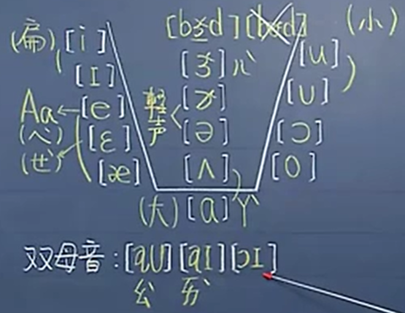

# Unit 1 KK音标

KK音标是由两个外国人共同研发出来的一个标明发音的符号，这两个人的名字刚好都是 K 开头。

KK音标分为母音和子音，需要先学习母音，再学习子音，因为一个母音可以单独存在，而一个子音必须要配上母音来发音。
简单记忆：母音是妈妈，子音是小孩子，妈妈可以单独在家，而小孩子一个人在家是不行的，很危险。

## A. 母音

- [ə][ɚ]：轻声
- 其余的母音：四声

### 14个单母音
| 左 | 中 | 右 |
| - | - | - |
| [i] | [ɝ] | [u] |
| [ɪ] | [ɚ] | [ᴜ] |
| [e] | [ə] | [ɔ] |
| [ɛ] | [ʌ] | [o] |
| [æ] | [ɑ] | |

### 双母音

[aᴜ] [aɪ] [ɔɪ]

